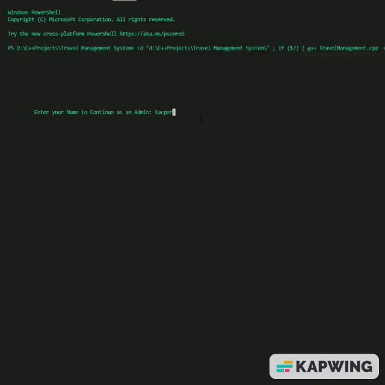
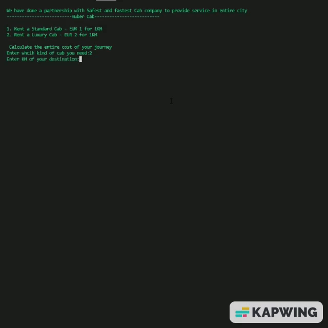

# TravelManagement 

Travel Management C++-based application store, and record new data in .txt file
if user want to check past data they can in (old-customers.txt), and new record stored in receipt.txt
Every new record update in old-customers.txt

<h3>Starting of this Application</h3>

<h3>Final Entery of this Application</h3>

